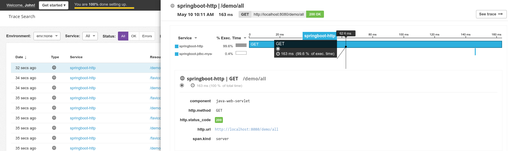

## Spring-boot + JDBC (MySQL) example
### Purpose

This project aims at demonstrating how to instrument legacy code based on the SpringBoot framework
and a MySQL JDBC connection.

Along with the [opentracing agent](https://github.com/opentracing-contrib/java-agent) we use 2 Opentracing contributions:
 * The JDBC contrib, that intercepts and trace all the calls to the DB
 * The Spring-Boot contrib, which intercepts and trace all incoming HTTP calls
 
Each contribution hides the complexity to the developers.

### Run the demo

#### Prerequisites
1. Please make sure that you read and executed the prerequisites provided [on this page](../../../raclette-java-examples/README.md)
2. Make also sure that you have a MySQL DB running (and an access to it). Then [Update your settings here](src/main/resources/application.properties).
    
#### Run the application

If you want to enable tracing you have to launch the application with the datadog java agent.

That can be done by providing the following JVM argument (assuming the `M2_REPO` env variable is set and we run version `0.0.1`):
`-javaagent:${M2_REPO}/com/datadoghq/dd-java-agent/0.0.1/dd-java-agent-0.0.1.jar`.

There are 2 ways to test it:

- Either with Maven: `mvn spring-boot:run -Djavaagent:${M2_REPO}/com/datadoghq/dd-java-agent/0.0.1/dd-java-agent-0.0.1.jar`
- Or if you prefer with your IDE providing the java agent command


### Generate traces

Once the application runs. Go to the following url:

* [http://localhost:8080/demo/add?name=foo&email=bar]()
* [http://localhost:8080/demo/all]()

Then, you will able to see traces directly to the DataDog UI.



### How did we instrument this project?

If you want to instrument your own code (Spring-boot and JDBC based), here is how you should do it.

#### Dependencies

#### Auto-instrumentation with the `dd-trace-agent`

The instrumentation is entirely done by the datadog agent which embed a set of rules that automatically recognizes & instruments:

- The java servlet filters

The datadog agent embeds the [open tracing java agent](https://github.com/opentracing-contrib/java-agent).

JDBC is not automatically instrumented yet by the agent. So you should follow the instructions on the next section.

#### JDBC tracing configuration

Just edit your `application.properties` [file](src/main/resources/application.properties)
and add `:tracing` right after the `jdbc` string as shown below.

```properties
spring.datasource.url= jdbc:tracing:mysql://localhost:3306/springdb
```