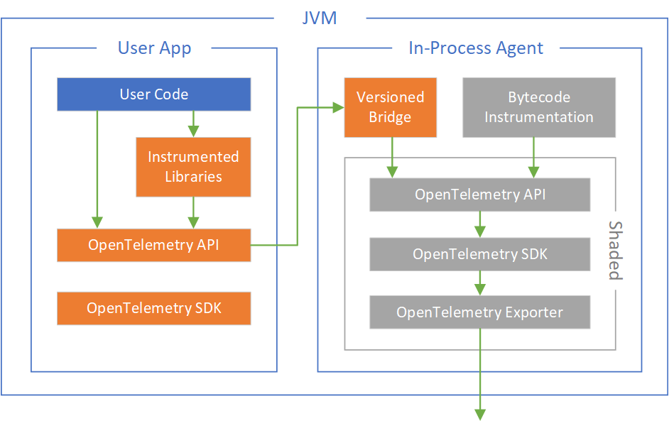
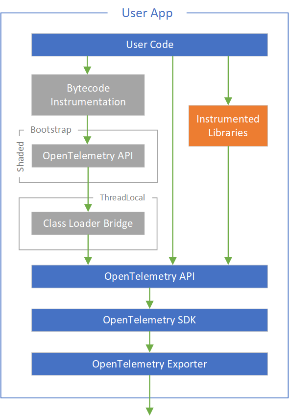

# Interoperability of bytecode instrumentation with user/library instrumentation

## Design

The orange components above may or may not be present, depending on whether the user app uses
the OpenTelemetry API (either directly or transitively via an instrumented library).

The rest of this section describes the components in the diagram above.

**Instrumented Libraries** - libraries that emit telemetry themselves directly
using the OpenTelemetry API.

**Versioned Bridge** - a bridge between the version of the OpenTelemetry API
brought by the user app, and the (shaded) OpenTelemetry API used internally by the Java agent.
The Java agent will rewrite io.opentelemetry.api.OpenTelemetry via bytecode instrumentation
so that users will get the versioned bridge as their implementation of the OpenTelemetry API.
In order to implement the OpenTelemetry API brought by the user app,
the versioned bridge needs to be injected into the class loader where that OpenTelemetry API lives.
The Java agent will inject an appropriate version of the bridge
that supports the version of the OpenTelemetry API brought by the user.
If the Java agent does not recognize the version of the OpenTelemetry API brought by the user app,
then it will not inject one (e.g. running an old version of the Java agent with a new version
of OpenTelemetry API).

**Bytecode Instrumentation** - bytecode instrumentation of well-known libraries.
This instrumentation needs to be injected into the class loader where the given library lives
(which could be the bootstrap class loader in cases like HttpURLConnection instrumentation).
In general, bytecode instrumentation will not be applied to libraries that are already instrumented
with OpenTelemetry API, e.g. if a future version of MongoDB emits telemetry via OpenTelemetry API,
then bytecode instrumentation will not be applied to those versions of MongoDB.

**Internal OpenTelemetry API** - we want the bytecode instrumentation to bind directly
to the OpenTelemetry API so that we can share code between bytecode and user/library instrumentation
where possible.
But the bytecode instrumentation can be injected into any class loader (e.g. HttpURLConnection),
and we cannot put OpenTelemetry API directly (unmodified) into the bootstrap class loader,
or it will cause version conflicts with user-brought OpenTelemetry API versions,
and so we must shade[1] the internal OpenTelemetry API.

**Internal OpenTelemetry SDK** - unlike the internal OpenTelemetry API, this does not need to live
in the bootstrap class loader, and thus can live in an isolated class loader to avoid conflict
with user-brought OpenTelemetry SDK (advantage of isolated class loader is to reduce shading
and attack surface area).
But it must still be partially shaded to match the shading of the internal OpenTelemetry API.
By default, this will be the standard OpenTelemetry SDK, but different vendors could replace this
with their own OpenTelemetry SDK implementation for advanced use cases.

**Internal OpenTelemetry Exporter** - same as above, this will live in an isolated class loader
in order to reduce shading and attack surface area, but still must be partially shaded
to match the shading of the internal OpenTelemetry API.
Different vendors will provide their own exporter here.
There may be an option for users to bring their own (unshaded) OpenTelemetry Exporter
and have the agent perform the required shading on the fly.

#### Open Questions

If there are multiple apps running in the same JVM, how to distinguish between them?

#### Risks

User code could cast OpenTelemetry API objects to the underlying OpenTelemetry SDK classes,
which would throw ClassCastException if it finds the Versioned Bridge class instead.
This may lead us to apply the Versioned Bridge as bytecode instrumentation
on the user-brought OpenTelemetry SDK, which is not as clean, but would avoid this issue.

Users who have configured the underlying SDK / exporter could be surprised
that the Java agent takes over, and their configuration work / exporter is not carried over.

## Alternate Design 1

If the user brings the OpenTelemetry API and the OpenTelemetry SDK,
the bytecode instrumentation could use the OpenTelemetry API brought by the user:

The Java agent could check which version of the OpenTelemetry API was brought by the user,
and only apply the bytecode instrumentation if it's compatible
with that version of the OpenTelemetry API.

#### Advantages

Users who have performed programmatic configuration of the SDK / exporter
do not lose that configuration.

If there are multiple apps running in the same JVM, it's easy to distinguish them
since they can each have their own SDK / exporter configuration.

#### Disadvantages

Classes outside of the user app cannot be instrumented since those classes do not have access
to the OpenTelemetry API brought by the user app. This includes classes brought by the JVM
(e.g. HttpURLConnection, java.util.logging, ExecutorService)
and the application server (e.g. HttpServlet and other Java EE classes).

## Alternate Design 2

The above disadvantage is pretty serious, so more likely
if we want the bytecode instrumentation to use the OpenTelemetry API brought by the user,
we would end up with something more like this:

This would work by having new server/consumer spans set the Class Loader Bridge
(pointing to the OpenTelemetry API brought by the user) into a ThreadLocal,
so that instrumentation on all classes during that span would be able to look up the bridge
and emit telemetry.

#### Advantages

Same as Alternate Design 1 above

#### Disadvantages

Bytecode instrumentation on classes outside of the user app cannot emit any telemetry
if there is not already an active span. This includes classes brought by the JVM
(e.g. HttpURLConnection, java.util.logging, ExecutorService)
and the application server (e.g. HttpServlet and other Java EE classes).

## Terminology

[1] Shading dependencies is the process of including and renaming dependencies
(thus relocating the classes & rewriting affected bytecode & resources)
to create a private copy that you bundle alongside your own code
(https://softwareengineering.stackexchange.com/questions/297276/what-is-a-shaded-java-dependency)
